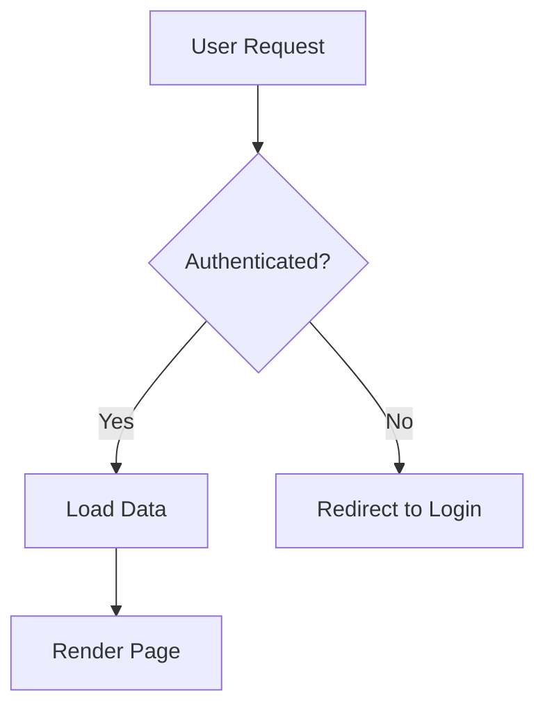
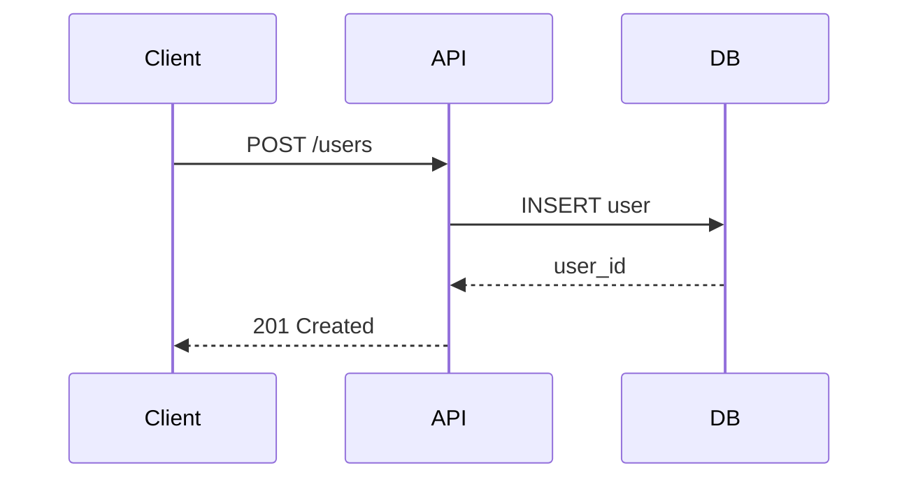
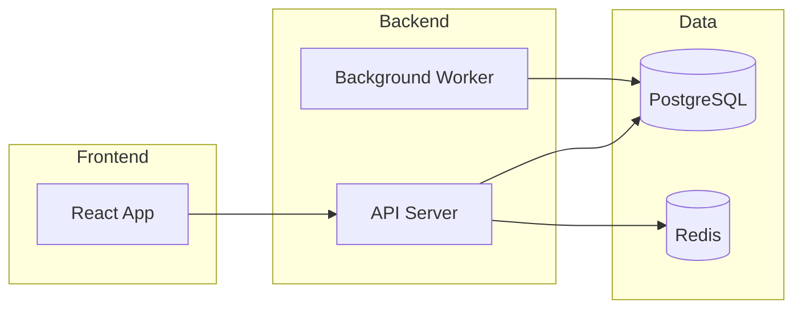

# ©2026 Brad Scheller

# Documentation Master

A comprehensive guide for creating, maintaining, and managing high-quality technical documentation across projects.

## When to Use

Invoke this skill when:

- **Writing new documentation**: READMEs, API docs, guides, runbooks
- **Documenting architecture**: ADRs, tech specs, system design docs
- **Creating templates**: Standardized documentation formats
- **API documentation**: Endpoint docs, OpenAPI specs, SDK references
- **Code documentation**: JSDoc, docstrings, inline comments
- **Quality reviews**: Auditing existing docs for accuracy and completeness
- **Onboarding materials**: Setup guides, contributing guidelines
- **User explicitly requests**: "document this", "write docs for...", "create README"

**Trigger phrases:**
- "Document this API"
- "Create a README"
- "Write an ADR for..."
- "Generate API documentation"
- "Review documentation quality"
- "Create onboarding docs"

## 1. README Template

Every project should have a clear, comprehensive README following this structure:

```markdown
# Project Name

Brief one-liner description of what this project does.

## Overview

2-3 paragraphs explaining:
- What problem this solves
- Who it's for
- Key features or differentiators

## Quick Start

```bash
# Fastest way to get running (copy-paste ready)
git clone [repo]
cd [project]
npm install
npm run dev
```

Visit http://localhost:3000

## Installation

### Prerequisites
- Node.js 18+
- Docker (optional)
- API keys required (link to setup)

### Steps

1. Clone the repository
2. Install dependencies
3. Configure environment variables
4. Initialize database
5. Start development server

### Environment Variables

```env
DATABASE_URL=postgresql://...
API_KEY=your_api_key
NODE_ENV=development
```

See `.env.example` for all options.

## Usage

### Basic Example

```javascript
import { Example } from 'library';

const result = await Example.run({
  option: 'value'
});
```

### Advanced Usage

Link to detailed guides or examples directory.

## API Reference

### Core Functions

#### `functionName(params)`

Description of what it does.

**Parameters:**
- `param1` (string): Description
- `param2` (object, optional): Description

**Returns:** `Promise<Result>`

**Example:**
```javascript
const result = await functionName('value');
```

## Architecture

Brief overview or link to `docs/architecture.md`.

Key components:
- Component A: handles X
- Component B: handles Y

## Development

### Project Structure
```
project/
├── src/           # Source code
├── tests/         # Test files
├── docs/          # Documentation
└── scripts/       # Build/deploy scripts
```

### Running Tests

```bash
npm test              # Unit tests
npm run test:e2e      # E2E tests
npm run test:coverage # Coverage report
```

### Code Style

- ESLint + Prettier
- Run `npm run lint` before committing
- Husky pre-commit hooks enforce standards

## Deployment

### Production Build

```bash
npm run build
npm start
```

### Docker

```bash
docker build -t project-name .
docker run -p 3000:3000 project-name
```

### Environment-Specific Notes

- **Staging**: Link to staging deployment guide
- **Production**: Link to production deployment guide

## Contributing

We welcome contributions! Please see [CONTRIBUTING.md](CONTRIBUTING.md).

### Development Workflow

1. Fork the repo
2. Create a feature branch (`git checkout -b feature/amazing`)
3. Commit changes (`git commit -m 'Add amazing feature'`)
4. Push to branch (`git push origin feature/amazing`)
5. Open a Pull Request

### Commit Convention

We use [Conventional Commits](https://conventionalcommits.org/):
- `feat:` new feature
- `fix:` bug fix
- `docs:` documentation changes
- `chore:` maintenance tasks

## License

[MIT License](LICENSE) - see LICENSE file for details

## Support

- **Issues**: [GitHub Issues](link)
- **Discussions**: [GitHub Discussions](link)
- **Email**: support@project.com

## Acknowledgments

- Contributors
- Libraries/tools used
- Inspirations
```

### README Checklist

- [ ] Project name and one-line description
- [ ] Installation instructions (copy-paste ready)
- [ ] Quick start example (works out of the box)
- [ ] Prerequisites clearly listed
- [ ] Environment variables documented
- [ ] Basic usage examples
- [ ] Link to full documentation
- [ ] Contributing guidelines
- [ ] License information
- [ ] Support/contact information

## 2. API Documentation

### Endpoint Documentation Format

For REST APIs, document each endpoint:

```markdown
### POST /api/users

Create a new user account.

**Authentication:** Required (Bearer token)

**Request Body:**
```json
{
  "email": "user@example.com",
  "name": "John Doe",
  "role": "developer"
}
```

**Parameters:**
- `email` (string, required): Valid email address
- `name` (string, required): User's full name
- `role` (string, optional): User role. Defaults to "user". Options: user, developer, admin

**Response: 201 Created**
```json
{
  "id": "usr_123abc",
  "email": "user@example.com",
  "name": "John Doe",
  "role": "developer",
  "createdAt": "2026-02-14T10:30:00Z"
}
```

**Error Responses:**

- `400 Bad Request`: Invalid email format or missing required fields
- `409 Conflict`: Email already exists
- `401 Unauthorized`: Missing or invalid authentication token

**Example:**
```bash
curl -X POST https://api.example.com/api/users \
  -H "Authorization: Bearer YOUR_TOKEN" \
  -H "Content-Type: application/json" \
  -d '{"email":"user@example.com","name":"John Doe"}'
```

**Rate Limit:** 100 requests per minute
```

### JSDoc for JavaScript/TypeScript

```javascript
/**
 * Calculates the total price including tax and discounts.
 *
 * @param {number} basePrice - The original price before adjustments
 * @param {Object} options - Calculation options
 * @param {number} [options.taxRate=0.1] - Tax rate as decimal (default 10%)
 * @param {number} [options.discount=0] - Discount amount to subtract
 * @param {string} [options.currency='USD'] - Currency code
 * @returns {number} The final price after tax and discounts
 * @throws {Error} If basePrice is negative
 *
 * @example
 * const total = calculatePrice(100, { taxRate: 0.15, discount: 10 });
 * // Returns: 104.5
 */
function calculatePrice(basePrice, options = {}) {
  if (basePrice < 0) {
    throw new Error('Base price cannot be negative');
  }

  const { taxRate = 0.1, discount = 0, currency = 'USD' } = options;
  return (basePrice - discount) * (1 + taxRate);
}
```

### Python Docstrings (Google Style)

```python
def process_data(input_file: str, output_format: str = 'json') -> dict:
    """Process data from input file and convert to specified format.

    Args:
        input_file: Path to the input CSV file
        output_format: Desired output format ('json' or 'xml'). Defaults to 'json'.

    Returns:
        A dictionary containing:
            - 'records': List of processed records
            - 'count': Total number of records
            - 'format': The output format used

    Raises:
        FileNotFoundError: If input_file does not exist
        ValueError: If output_format is not 'json' or 'xml'

    Examples:
        >>> result = process_data('data.csv', 'json')
        >>> print(result['count'])
        42
    """
    pass
```

### OpenAPI/Swagger Specification

Store OpenAPI specs in `docs/api/openapi.yaml`:

```yaml
openapi: 3.0.0
info:
  title: Project API
  version: 1.0.0
  description: RESTful API for project management

servers:
  - url: https://api.example.com/v1
    description: Production
  - url: https://staging.api.example.com/v1
    description: Staging

paths:
  /users:
    get:
      summary: List users
      tags:
        - Users
      parameters:
        - name: page
          in: query
          schema:
            type: integer
            default: 1
        - name: limit
          in: query
          schema:
            type: integer
            default: 20
      responses:
        '200':
          description: Successful response
          content:
            application/json:
              schema:
                type: object
                properties:
                  users:
                    type: array
                    items:
                      $ref: '#/components/schemas/User'
                  pagination:
                    $ref: '#/components/schemas/Pagination'

components:
  schemas:
    User:
      type: object
      properties:
        id:
          type: string
        email:
          type: string
        name:
          type: string
  securitySchemes:
    bearerAuth:
      type: http
      scheme: bearer
```

### Auto-Generation Tools

- **TypeScript**: Use `typedoc` for API reference generation
- **Python**: Use `sphinx` or `pdoc`
- **OpenAPI**: Generate from code with `tsoa`, `fastify-swagger`, or `drf-spectacular`
- **GraphQL**: Use `graphql-markdown` or GraphQL Playground

## 3. Architecture Decision Records (ADRs)

ADRs document significant architectural decisions. Store in `docs/adr/`.

### ADR Template

```markdown
# ADR-001: Use PostgreSQL for Primary Database

**Status:** Accepted

**Date:** 2026-02-14

**Deciders:** @alice, @bob, @charlie

## Context

We need to choose a database for our SaaS application that will:
- Handle relational data with complex queries
- Support multi-tenancy with row-level security
- Scale to millions of records
- Provide ACID guarantees for transactions

Current options: PostgreSQL, MySQL, MongoDB, DynamoDB

## Decision

We will use PostgreSQL 15+ as our primary database.

## Rationale

**Pros:**
- Native JSON support for flexible schema sections
- Row-level security (RLS) ideal for multi-tenant isolation
- Excellent query planner and performance at scale
- Strong ecosystem (Prisma, PostgREST, pg_vector for AI features)
- ACID compliance
- Mature replication and backup solutions

**Cons:**
- Slightly more complex to operate than managed NoSQL
- Requires careful index management for performance
- Vertical scaling limits (mitigated by read replicas)

**Alternatives considered:**
- **MySQL**: Lacks robust JSON support and RLS
- **MongoDB**: No ACID across documents, weaker consistency
- **DynamoDB**: Vendor lock-in, complex query patterns

## Consequences

**Positive:**
- Can model user data, subscriptions, and analytics in one system
- Prisma ORM provides type-safe migrations
- Easy to add full-text search (pg_trgm, pg_search)
- Can add vector search later (pgvector) for AI features

**Negative:**
- Team needs to learn PostgreSQL-specific features (RLS, JSONB)
- Must plan for connection pooling (PgBouncer)
- Backup/restore strategy required before production

**Migration path:**
- If we outgrow single Postgres instance: add read replicas
- If we need multi-region: migrate to CockroachDB (Postgres-compatible)

## Follow-up Actions

- [ ] Set up managed PostgreSQL (Supabase or Neon)
- [ ] Configure Prisma schema with RLS policies
- [ ] Document backup/restore procedures
- [ ] Add connection pooling to production deployment

## References

- [PostgreSQL vs MySQL comparison](link)
- [Row-Level Security documentation](link)
- [Prisma Best Practices](link)
```

### ADR Status Lifecycle

- **Proposed**: Under discussion
- **Accepted**: Decision made, implementation pending
- **Implemented**: Fully rolled out
- **Deprecated**: No longer recommended
- **Superseded**: Replaced by ADR-XXX

### When to Write an ADR

Write an ADR when:
- Choosing core technologies (language, framework, database)
- Changing system architecture (monolith → microservices)
- Selecting third-party services (auth provider, payment gateway)
- Making infrastructure decisions (cloud provider, deployment strategy)
- Establishing coding standards or patterns
- **NOT needed for**: small refactors, bug fixes, feature implementations

## 4. Technical Specifications

Tech specs bridge architecture and implementation. Use for complex features.

### Tech Spec Template

```markdown
# Tech Spec: Real-Time Collaborative Editing

**Author:** @alice
**Reviewers:** @bob, @charlie
**Status:** In Review
**Date:** 2026-02-14
**Related:** ADR-005, story-editor-001

## Overview

Add real-time collaborative editing to documents, allowing multiple users to edit simultaneously with conflict-free sync.

**Goals:**
- Support 5-10 concurrent editors per document
- Sub-200ms latency for local edits
- Offline support with sync on reconnect
- Version history preservation

**Non-Goals:**
- Real-time video/audio (separate feature)
- Collaborative cursors/presence indicators (phase 2)

## Background

Users currently can't collaborate on documents in real-time. They resort to copying content to Google Docs, then pasting back — losing formatting and version history.

**User Impact:** 3,000+ users requested this feature. 40% of teams have 2+ editors per document.

## Technical Approach

### High-Level Design

```
┌─────────────┐         WebSocket          ┌─────────────┐
│   Client    │◄─────────────────────────►│   Server    │
│  (React)    │      CRDT Operations       │  (Node.js)  │
└─────────────┘                            └──────┬──────┘
      │                                           │
      │ IndexedDB                         ┌───────▼──────┐
      │ (offline)                         │  PostgreSQL  │
      │                                   │  (ops log)   │
      └───────────────────────────────────┴──────────────┘
```

### Architecture Decisions

1. **CRDT (Yjs)**: Conflict-free sync without central authority
2. **WebSocket transport**: y-websocket for bi-directional sync
3. **IndexedDB persistence**: y-indexeddb for offline edits
4. **Postgres ops log**: Store operations for audit/version history

### Data Model

```typescript
// Document state (CRDT)
interface YDoc {
  id: string;
  content: Y.XmlFragment; // Rich text
  metadata: Y.Map<any>;   // Title, created, etc.
}

// Operation log (Postgres)
table document_operations {
  id: uuid primary key;
  document_id: uuid references documents;
  user_id: uuid references users;
  operation: jsonb;        // Yjs update
  timestamp: timestamptz;
  client_id: text;
}
```

### API Design

```typescript
// WebSocket messages
type Message =
  | { type: 'sync-step-1'; stateVector: Uint8Array }
  | { type: 'sync-step-2'; update: Uint8Array }
  | { type: 'update'; update: Uint8Array };

// REST endpoints (unchanged)
GET    /api/documents/:id         // Load document
POST   /api/documents              // Create new
GET    /api/documents/:id/history  // Version history
```

### Security Considerations

- **Authentication**: Existing JWT validation on WebSocket handshake
- **Authorization**: Check `canEdit` permission before accepting ops
- **Rate limiting**: 100 ops/second per user
- **Validation**: Reject ops for wrong document_id

### Performance

**Metrics:**
- P50 edit latency: <100ms (local)
- P95 edit latency: <200ms (local)
- P99 sync latency: <500ms (cross-region)

**Scalability:**
- Single server: 1,000 concurrent connections
- Horizontal scaling: Route by document_id (sticky sessions)

### Testing Strategy

- **Unit tests**: CRDT merge operations, conflict resolution
- **Integration tests**: Multi-client sync scenarios
- **Load tests**: 100 clients editing same document
- **Chaos tests**: Network partitions, server crashes

## Implementation Plan

### Phase 1: MVP (2 weeks)
- [ ] Set up Yjs + y-websocket
- [ ] Basic sync between 2 clients
- [ ] Persist ops to Postgres
- [ ] Deploy to staging

### Phase 2: Production (1 week)
- [ ] WebSocket authentication
- [ ] Permission checks
- [ ] Monitoring + alerting
- [ ] Production deployment

### Phase 3: Offline (1 week)
- [ ] IndexedDB persistence
- [ ] Sync on reconnect
- [ ] Conflict UI (show merges)

## Risks & Mitigations

| Risk | Impact | Mitigation |
|------|--------|------------|
| CRDT merge bugs | High | Extensive testing, gradual rollout |
| WebSocket scaling | Medium | Load balancer with sticky sessions |
| Postgres write load | Medium | Batch ops, async writes |
| Large document perf | Medium | Lazy load content, paginate ops |

## Alternatives Considered

1. **Operational Transform (OT)**: More complex, requires central server
2. **Firebase/Firestore**: Vendor lock-in, expensive at scale
3. **Automerge**: Pure JS CRDT, but slower than Yjs

## Open Questions

- Should we compress WebSocket messages? (Answer: Yes, gzip)
- How long to retain operation log? (Answer: 90 days, then snapshot)
- Offline conflict resolution UI? (Answer: Phase 3)

## References

- [Yjs documentation](https://docs.yjs.dev/)
- [CRDT explanation](https://crdt.tech/)
- [WebSocket scaling patterns](link)
```

### Tech Spec Checklist

- [ ] Clear goals and non-goals
- [ ] Architecture diagram
- [ ] API/interface design
- [ ] Data models
- [ ] Security considerations
- [ ] Performance metrics
- [ ] Testing strategy
- [ ] Implementation phases
- [ ] Risks identified
- [ ] Alternatives evaluated

## 5. Code Comments Best Practices

### When to Comment

**DO comment:**
- **Why, not what**: Explain reasoning, not obvious code
- **Non-obvious algorithms**: Complex logic, performance hacks
- **Public APIs**: JSDoc/docstrings for exported functions
- **Workarounds**: Link to issue explaining why
- **TODOs**: Actionable items with context

**DON'T comment:**
- **Obvious code**: `i++; // increment i` ← bad
- **Outdated info**: Comments drift from code
- **Apologizing**: "This is a hack" without explanation
- **Commented-out code**: Delete it (Git remembers)

### Comment Patterns

#### Explain Complex Logic

```javascript
// Use binary search for O(log n) lookup.
// Array is pre-sorted by timestamp in data pipeline.
const index = binarySearch(events, targetTime);
```

#### Document Workarounds

```javascript
// WORKAROUND: Safari doesn't support lookbehind in regex (2026)
// See: https://github.com/project/issues/123
const fallbackPattern = /alternative-pattern/;
```

#### Public API Documentation

```typescript
/**
 * Authenticates a user and returns a JWT token.
 *
 * @param email - User's email address
 * @param password - Plain text password (will be hashed)
 * @returns Promise resolving to { token, user } on success
 * @throws {AuthError} If credentials are invalid
 */
export async function login(email: string, password: string) {
  // Implementation...
}
```

#### TODO Conventions

```javascript
// TODO(@alice): Refactor to use new API after v2 migration (issue #456)
// TODO: Add rate limiting (blocked by ADR-008 decision)
// FIXME: Memory leak when processing large files (reproduce: test/leak.spec.js)
// HACK: Temporary fix for production bug, replace in sprint 24
```

### JSDoc Tags Reference

```javascript
/**
 * @param {Type} name - Description
 * @returns {Type} Description
 * @throws {ErrorType} When this happens
 * @example
 * const result = func();
 * @see relatedFunction
 * @deprecated Use newFunction instead
 * @since 2.1.0
 * @author @username
 */
```

## 6. Runbooks & Operational Guides

### Troubleshooting Runbook Template

```markdown
# Runbook: Database Connection Pool Exhausted

**Symptom:** API returning 500 errors, logs show "connection pool exhausted"

**Severity:** High (service degraded)

**On-Call Response Time:** 15 minutes

## Diagnosis

### 1. Confirm the Issue

```bash
# Check error logs
kubectl logs -n production api-server --tail=100 | grep "pool exhausted"

# Check active connections
psql -h db.prod -c "SELECT count(*) FROM pg_stat_activity;"
```

**Expected:** <100 connections
**Alert threshold:** >90 connections

### 2. Identify Root Cause

Common causes:
- Traffic spike (check metrics dashboard)
- Long-running query blocking connections
- Connection leak in recent deployment

```bash
# Check for long-running queries
psql -h db.prod -c "
  SELECT pid, now() - query_start AS duration, query
  FROM pg_stat_activity
  WHERE state = 'active'
  ORDER BY duration DESC
  LIMIT 10;
"
```

## Immediate Mitigation

### Option 1: Restart API Servers (30s downtime)

```bash
kubectl rollout restart deployment/api-server -n production
```

**When to use:** No long queries, likely connection leak

### Option 2: Kill Long Queries

```bash
# Kill specific query
psql -h db.prod -c "SELECT pg_terminate_backend(PID);"
```

**When to use:** Identified blocking query

### Option 3: Scale Up Pool

```bash
# Temporarily increase max connections
kubectl set env deployment/api-server MAX_POOL_SIZE=150 -n production
```

**When to use:** Legitimate traffic spike

## Long-Term Fix

1. Review recent deployments for connection leaks
2. Add connection pool monitoring alerts (<80% threshold)
3. Implement query timeout (10s for API queries)
4. Consider read replicas if traffic growth continues

## Prevention

- [ ] Add unit tests for connection cleanup
- [ ] Set `idle_in_transaction_session_timeout` in Postgres
- [ ] Enable connection pool metrics in Datadog

## Post-Incident

- Document cause in incident report
- Update alerts if false positive
- Schedule retro if recurring issue
```

### Setup Guide Template

```markdown
# Development Environment Setup

**Time required:** 30 minutes
**Skill level:** Intermediate

## Prerequisites

Before starting, ensure you have:
- [ ] macOS 12+ / Windows 11 + WSL2 / Ubuntu 22.04+
- [ ] Git 2.40+
- [ ] Node.js 18+ (use `nvm` or `fnm`)
- [ ] Docker Desktop 4.0+ (optional, for local DB)

## Step 1: Clone Repository

```bash
git clone git@github.com:org/project.git
cd project
```

## Step 2: Install Dependencies

```bash
npm install
```

**Troubleshooting:**
- If `npm install` fails with EACCES: [Fix npm permissions](link)
- If node-gyp errors: Install build tools (`xcode-select --install` on macOS)

## Step 3: Configure Environment

```bash
cp .env.example .env
```

Edit `.env` and set:
- `DATABASE_URL`: Get from 1Password vault "Dev DB"
- `API_KEY`: Generate at https://dashboard.service.com/keys

## Step 4: Initialize Database

### Option A: Docker (Recommended)

```bash
docker compose up -d postgres
npm run db:migrate
npm run db:seed
```

### Option B: Local Postgres

```bash
createdb project_dev
npm run db:migrate
npm run db:seed
```

## Step 5: Start Development Server

```bash
npm run dev
```

Visit http://localhost:3000

## Verification

Run health check:
```bash
curl http://localhost:3000/api/health
# Expected: {"status":"ok","db":"connected"}
```

## Next Steps

- Read [CONTRIBUTING.md](CONTRIBUTING.md)
- Join #dev-chat on Slack
- Review open "good first issue" tickets

## Common Issues

**Port 3000 already in use:**
```bash
lsof -ti:3000 | xargs kill
```

**Database migration fails:**
```bash
npm run db:reset  # ⚠️  Deletes all data
```

**Module not found errors:**
```bash
rm -rf node_modules package-lock.json
npm install
```
```

## 7. Documentation Quality Management

### Documentation Review Checklist

**Accuracy:**
- [ ] All code examples tested and working
- [ ] Links valid (no 404s)
- [ ] Commands copy-paste ready
- [ ] Screenshots up-to-date
- [ ] Version numbers accurate

**Completeness:**
- [ ] Prerequisites listed
- [ ] Error cases documented
- [ ] All parameters explained
- [ ] Return values described
- [ ] Examples provided

**Clarity:**
- [ ] Jargon explained or linked
- [ ] Active voice used
- [ ] Steps numbered and sequential
- [ ] Visual aids (diagrams, screenshots) where helpful
- [ ] Consistent terminology

**Maintainability:**
- [ ] No hardcoded values (use placeholders)
- [ ] Version-agnostic where possible
- [ ] Modular (can update sections independently)
- [ ] Single source of truth (no duplication)

### Keeping Docs in Sync

**Documentation-as-Code Practices:**

1. **Co-locate docs with code**: Feature docs in same PR
2. **Automated checks**:
   ```bash
   # Check for broken links
   npm run docs:check-links

   # Validate code examples compile
   npm run docs:test-examples
   ```
3. **Version docs with code**: Tag releases, maintain changelog
4. **Require doc updates**: CI fails if docs not updated for public API changes

**Example GitHub Actions Check:**

```yaml
name: Documentation Check
on: [pull_request]

jobs:
  docs:
    runs-on: ubuntu-latest
    steps:
      - uses: actions/checkout@v3
      - name: Check broken links
        run: npx markdown-link-check README.md docs/**/*.md
      - name: Validate API examples
        run: npm run test:docs
      - name: Check OpenAPI spec sync
        run: npm run openapi:validate
```

### Documentation Debt

**Signs of doc debt:**
- User questions answered repeatedly in Slack
- Outdated screenshots or version references
- "This is deprecated" comments without replacement
- Missing docs for recently added features

**Prioritization:**
- **P0**: Production runbooks, security docs, deployment guides
- **P1**: API references, setup guides, architecture docs
- **P2**: Tutorials, best practices, examples
- **P3**: Historical context, design rationale

**Quarterly doc audit:**
1. Run link checker across all docs
2. Test all setup/installation guides
3. Update version references
4. Archive outdated content (move to `/archive`, don't delete)

## 8. Tools & Ecosystems

### Static Site Generators

**Docusaurus (React-based)**
```bash
npx create-docusaurus@latest my-docs classic
cd my-docs
npm start
```

Best for:
- Open source projects
- Versioned documentation
- MDX support (React components in Markdown)
- Built-in search (Algolia)

**Mintlify**
```bash
npx mintlify init
```

Best for:
- API documentation
- Modern, polished UI out of the box
- OpenAPI integration
- Interactive code playgrounds

**VitePress (Vue-based)**
```bash
npm create vitepress@latest
```

Best for:
- Extremely fast builds
- Minimalist design
- Vue ecosystem projects

### Markdown Tips

**Admonitions/Callouts:**

```markdown
> **Note:** This is informational.

> **Warning:** Proceed with caution.

> **Tip:** Pro tip for advanced users.
```

**Code blocks with highlighting:**

```markdown
```javascript {2,5-7}
function example() {
  const highlighted = true;  // Line 2 highlighted
  const normal = false;

  if (highlighted) {         // Lines 5-7 highlighted
    return "useful!";
  }
}
```
```

**Collapsible sections:**

```markdown
<details>
<summary>Click to expand</summary>

Hidden content here. Useful for:
- Long error logs
- Optional advanced configuration
- Appendices
</details>
```

**Tables:**

```markdown
| Feature      | Open Source | Pro   |
|--------------|-------------|-------|
| Basic docs   | ✅          | ✅    |
| Versioning   | ✅          | ✅    |
| Custom theme | ❌          | ✅    |
```

### Mermaid Diagrams

Embed diagrams directly in Markdown (supported by GitHub, GitLab, Docusaurus):

```markdown

```

**Sequence diagrams:**



**Architecture diagrams:**



### Notion for Internal Docs

**When to use Notion vs Git:**
- **Git (Markdown)**: Product docs, API reference, setup guides (public, versioned)
- **Notion**: Internal processes, meeting notes, brainstorming, team wikis (collaborative, searchable)

**Best practices:**
- Link Notion docs from README (`## Internal Docs: [Notion workspace](link)`)
- Export critical Notion docs to Markdown quarterly (backup)
- Use Notion API to sync status/metrics to docs site

### OpenAPI Tools

**Generate docs from spec:**
```bash
# Redoc (clean, modern)
npx redoc-cli bundle openapi.yaml -o docs/api.html

# Swagger UI (interactive)
npx swagger-ui-watcher openapi.yaml
```

**Generate spec from code:**
```typescript
// Using tsoa
import { Controller, Get, Route } from 'tsoa';

@Route('users')
export class UsersController extends Controller {
  @Get('{userId}')
  public async getUser(userId: string): Promise<User> {
    // Implementation
  }
}

// Run: npm run tsoa:spec → generates openapi.json
```

## 9. Workflow Integration

### Documentation Workflow

**For New Features:**

1. **Design phase**: Write tech spec (if complex)
2. **Implementation**: Add JSDoc/docstrings to public APIs
3. **PR checklist**:
   - [ ] Update README if user-facing
   - [ ] Add API docs if endpoint added
   - [ ] Update CHANGELOG.md
4. **Post-merge**: Deploy docs site (if separate)

**For Bug Fixes:**

- Update runbook if operational issue
- Add troubleshooting section to docs if user-reported

**For Breaking Changes:**

- Write migration guide
- Update CHANGELOG with `## [BREAKING]` section
- Add deprecation notices to old docs

### Documentation Prompts

When user says "document this", ask:

1. **Audience**: Developers, end-users, operators?
2. **Scope**: Single function, entire API, system architecture?
3. **Format**: README section, standalone guide, inline comments?
4. **Depth**: Quick reference or comprehensive guide?

Then delegate to appropriate pattern:
- Code → Add JSDoc/docstrings
- API → Create endpoint documentation
- Feature → Write user guide
- System → Create architecture doc or ADR
- Runbook → Write troubleshooting guide

## Summary

Documentation is a first-class deliverable, not an afterthought. Good docs:
- **Save time**: Answer questions once, reference forever
- **Enable scaling**: New contributors onboard faster
- **Reduce errors**: Clear runbooks prevent outages
- **Build trust**: Users confident in well-documented projects

**Key principles:**
1. **Write for your future self**: You'll forget implementation details in 3 months
2. **Show, don't just tell**: Code examples > prose
3. **Keep it current**: Stale docs worse than no docs
4. **Make it scannable**: Headers, lists, diagrams
5. **Test your docs**: If setup guide doesn't work, it's broken

Use this skill as a reference when creating or reviewing documentation across any project.
